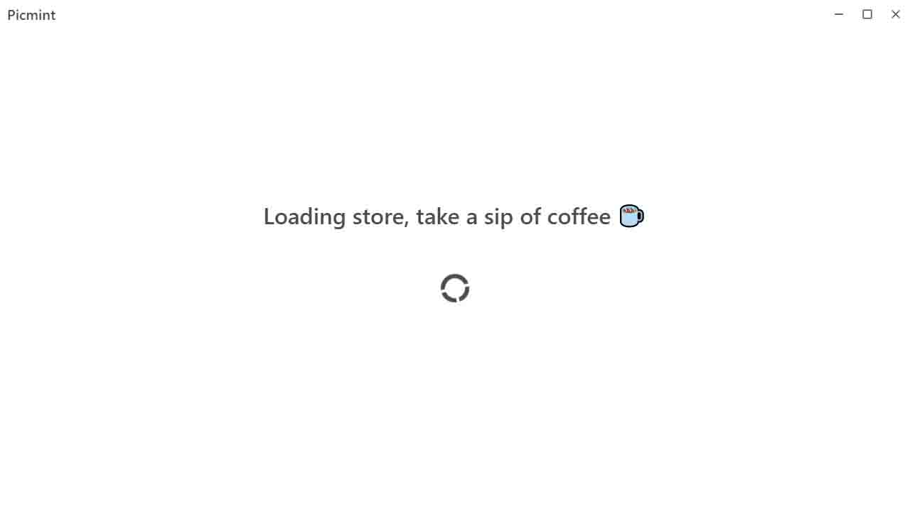

# Picmint

> A tag based picture manager

Download prebuilt binary distribution at [Release Page](https://github.com/yewmint/picmint/releases)

## Feature

1. Manage pictures in place, won't damage any of your treasures.
2. Use file hash to avoid duplicates and keep tags available even if picture itself has been removed.
3. Incrediablly fast with cache.
4. Cosy user experience with smooth animation.

## Screen shots





## Build Setup

For development:

``` bash
# launch webpack dev server
yarn run dev:renderer

# build main script and launch electron
yarn run dev:main && yarn start
```

For production:

``` bash
# build all scrips and pack into binaries
yarn build
```
